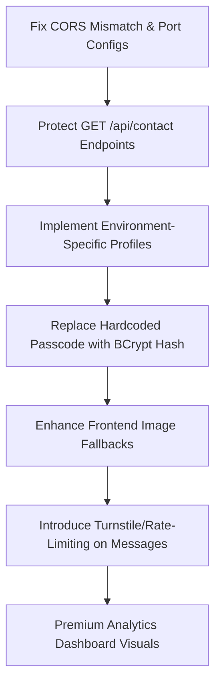

# ARCHITECTURAL AUDIT & STRATEGIC REVIEW
**Target Project:** Full-Stack Personal Portfolio  
**Consultant Level:** Principal Full-Stack Engineer (10+ YOE)  
**Estimated Project Value:** $100,000 USD Client Spec  

---

## Executive Summary
This portfolio project exhibits a **high-quality, visually engaging frontend foundation** with micro-interactions, custom styling variables, a file-backed database persistence layer, and impressive live project simulators. 

However, to position this product for enterprise-grade clients, high-paying engineering roles, or premium freelance contracts, several **critical security vulnerabilities**, **architectural conflicts**, and **UX shortcomings** must be resolved. 

This report details these findings and outlines an actionable refactoring plan.

---

## 1. Critical Security Vulnerabilities (High Risk)
These must be addressed immediately to protect server data integrity and prevent leakage of client information.

### 🔴 Vulnerability A: Public Message Leakage (Data Privacy)
*   **Location:** `ContactController.java` (`/api/contact` and `/api/contact/count`)
*   **Finding:** The endpoints `GET /api/contact` and `GET /api/contact/count` have **no authorization checks**. Anyone visiting the URL can view every contact form submission, exposing names, email addresses, and confidential messages sent by potential clients.
*   **Impact:** Massive breach of privacy. Attackers can scrape data, harvest emails, or read proprietary inquiries.
*   **Resolution:** Bind these endpoints under the admin authentication check.

### 🔴 Vulnerability B: Hardcoded Credentials & Cleartext Authentication
*   **Location:** `PortfolioController.java` (line 17) & `AdminDashboard.jsx` (line 51)
*   **Finding:** The admin authentication relies on a hardcoded, static string `"admin123"`. 
    1.  The frontend validates this locally and stores it in `sessionStorage` in plain text.
    2.  The backend verifies it by checking if the incoming request's `Authorization` header exactly matches the plaintext string `"admin123"`.
*   **Impact:** Extremely easy to bypass. Storing plaintext passwords in session storage invites cross-site scripting (XSS) extraction. Hardcoding credentials in compiled binaries requires redeployment to change.
*   **Resolution:** 
    *   Store a BCrypt-hashed password in the database or an environment variable (`ADMIN_PASSCODE_HASH`).
    *   Use Spring Security + JWT or session-based cookies for stateful authentication, issuing a cryptographically signed token upon verification.

### 🔴 Vulnerability C: Unsecured H2 Console & Database Configuration
*   **Location:** `application.properties` (lines 6-16)
*   **Finding:** H2 console is enabled globally (`spring.h2.console.enabled=true`) and the database password is left blank (`spring.datasource.password=`).
*   **Impact:** If deployed to a live server, anyone can navigate to `/h2-console`, log in with no password, inspect schemas, alter user data, or inject malicious payloads.
*   **Resolution:** 
    *   Secure `/h2-console` with Spring Security filters.
    *   Set a strong, environment-injected password.
    *   Disable H2 console completely in production configurations.

---

## 2. Architectural & Integration Issues (Medium Risk)
These issues disrupt runtime operations, deployment cycles, and standard development workflows.

### 🟡 Issue A: CORS Mismatch and Port Conflicts
*   **Location:** `PortfolioController.java` (line 14) vs `application.properties` (line 19)
*   **Finding:**
    *   The controller hardcodes `@CrossOrigin(origins = "http://localhost:5175")`.
    *   The global `CorsConfig.java` reads `app.cors.allowed-origins` which is configured to `http://localhost:5173`.
    *   The React frontend dev server runs on `http://localhost:5173` by default.
*   **Impact:** The controller-level `@CrossOrigin` overrides the global `CorsConfig` filter for the `/api/profile` endpoint. Consequently, if the frontend makes a request from port `5173`, the browser blocks it due to a CORS policy violation.
*   **Resolution:** Delete `@CrossOrigin` annotations from controllers. Control CORS configurations strictly from `CorsConfig.java` utilizing the properties file.

### 🟡 Issue B: Lack of Environment-Specific Configuration Profiles
*   **Location:** `backend/src/main/resources/`
*   **Finding:** All database configurations, credentials, ports, and CORS policies are bundled in a single `application.properties` file.
*   **Impact:** Dev configurations (like debug logging and H2 DB) leak into production environments. Database paths are hardcoded to local directories (`./data/portfoliodb`), causing potential write-permission issues in containerized cloud hosts (like Render, AWS ECS, or Fly.io).
*   **Resolution:** Define configuration profiles:
    *   `application-dev.properties` (using file H2, enabled console, localhost CORS).
    *   `application-prod.properties` (using PostgreSQL/MySQL, disabled H2 console, production domain CORS, SSL enforced).

---

## 3. Frontend & UX Optimizations (Low Risk / Polish)
Enhancements to make the client experience feel premium, seamless, and performant.

### 🟢 Enhancement A: Elegant Image Error Fallbacks
*   **Location:** `Projects.jsx` (lines 101-103)
*   **Finding:** If a project card image fails to load, the `onError` handler hides the image element completely: `e.target.style.display = 'none';`.
*   **Impact:** Hiding the image leaves the card with an empty, asymmetric layout, disrupting the alignment of text and interactive buttons.
*   **Resolution:** Implement a beautiful skeleton loader or a CSS gradient placeholder showcasing the project initials (e.g., "FE" for FarmLink) with a subtle glowing pulse animation.

### 🟢 Enhancement B: SEO Strategy & Prerendering
*   **Location:** Frontend Architecture (`Vite` + `React`)
*   **Finding:** The frontend is configured as a client-side rendered (CSR) Single Page Application (SPA).
*   **Impact:** Web crawlers (Google, Bing, LinkedIn scraper) may read an empty HTML shell because JavaScript execution is required to hydrate the portfolio data from the backend. This limits search engine visibility and prevents rich link previews (metadata cards) from displaying on social platforms.
*   **Resolution:**
    *   Incorporate `react-helmet-async` to dynamically update document title and meta description tags.
    *   For a true $100k production scale, configure Vite for pre-rendering (using plugins like `vite-plugin-prerender`) or transition the routing into a Next.js (SSG) configuration.

### 🟢 Enhancement C: Rate-Limiting & Spam Prevention
*   **Location:** `ContactController.java`
*   **Finding:** The `/api/contact` submission endpoint has no rate-limiting or protection.
*   **Impact:** Automated scripts can spam the endpoint, flooding the DB with garbage contact messages and inflating server hosting costs.
*   **Resolution:** Implement a bucket-based rate limiter (like Bucket4j) or integrate a modern captcha system (like Cloudflare Turnstile) on the frontend.

---

## 4. Premium Value-Add Recommendations
To exceed client expectations and deliver a $100k-tier product, consider implementing the following high-end features:

1.  **Dynamic PDF Resume Generator:** Add a button in the Education/Experience sections that generates a highly-styled, customized PDF resume on-the-fly using `pdfmake` or custom backend JasperReports.
2.  **Live Visitor Analytics Dashboard:** Expand the CMS analytics page from showing simple total counters to presenting a sleek dashboard containing SVG traffic charts (views by page/date, user-agent distributions) using `Recharts` or native CSS bar scales.
3.  **Automated Email Alerts:** Integrate Spring Boot with an email service (SMTP/SendGrid). When a visitor submits a contact form, the server should trigger a real-time email notification to the administrator and a beautiful HTML auto-response receipt to the client.

---

## Action Plan: Priority Sequence
Below is the proposed sequence of changes to resolve the critical security issues and fix the CORS dev blockers:

---
*Prepared by Antigravity — Principal Full-Stack Consultant*
